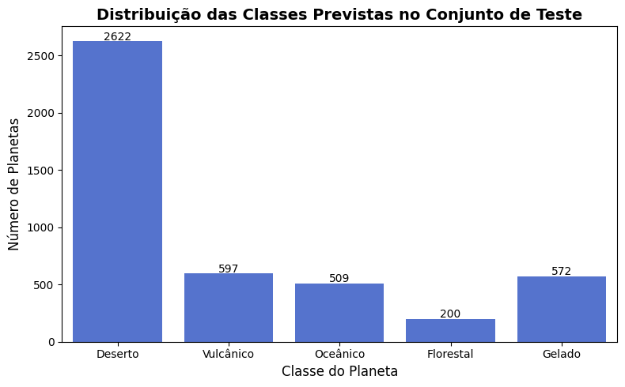

# Modelo de IA para Previsão de Dados - ONIA 2025  🤖📊💻

Este repositório contém o código utilizado na terceira fase da **Olimpíada Nacional de Inteligência Artificial (ONIA) 2025**<sup>1</sup>, que consistia em desenvolver um modelo de aprendizado de máquina para prever o target<sup>2</sup> de um conjunto de dados de teste, com base em um conjunto de dados de treinamento rotulado. 
O modelo criado foi um **Random Forest Classifier**, um algoritmo robusto de **ensemble learning** que combina várias árvores de decisão para fazer previsões de forma precisa e eficiente.

O desafio proposto foi prever as classes dos planetas no conjunto de dados de teste, onde as classes eram relacionadas a diferentes tipos de planetas (Deserto, Vulcânico, Oceânico, Florestal e Gelado). 

A nota final obtida no exame foi 6,94, um bom resultado, embora o modelo não tenha alcançado um desempenho satisfatório. O código e os resultados presentes neste repositório refletem os esforços para criar um modelo eficiente e capaz de capturar os padrões dos dados, mas também indicam que há espaço para aprimoramentos e ajustes.

> 1. **ONIA Brasil**: Competição científica anual, gratuita e voluntária, organizada por EduSpace, H2IA/UFPel e IIA/LNCC, com o objetivo de promover o conhecimento e inovação em inteligência artificial, incentivando estudantes de todo o Brasil a desenvolver habilidades na área.


> 2. **Target**: Variável ou classe que o modelo de aprendizado de máquina tenta prever com base nas características de entrada.

## Estrutura do Repositório

O repositório está estruturado da seguinte forma:

```
/codigo
    ├── README.md                # Arquivo de documentação do projeto
    ├── grafico-onia2025.png     # Gráfico gerado durante a execução do modelo
    ├── main.py                  # Código do modelo Random Forest
    ├── predicoes.csv            # Resultados das previsões no conjunto de teste
    ├── teste.csv                # Dados de teste não rotulados
    └── treino.csv               # Dados de treinamento rotulados
```

## Descrição do Código

O código contido neste repositório segue a seguinte lógica para treinamento e previsão:

1. **Carregamento dos Dados**  
   O código começa carregando os conjuntos de dados de treinamento (`treino.csv`) e teste (`teste.csv`) usando a biblioteca **pandas**. O arquivo de treinamento contém a variável `target` rotulada, enquanto o arquivo de teste contém apenas as características dos planetas a serem previstos.

2. **Pré-processamento dos Dados**  
   - **Conjunto de Treinamento:** As colunas `id` e `target` são separadas das variáveis preditoras (features). O conjunto de treinamento é então dividido em `X_train` (features) e `y_train` (target).
   - **Conjunto de Teste:** O conjunto de teste é processado para remover a coluna `id`, deixando apenas as features para fazer as previsões.

3. **Treinamento do Modelo**  
   Um modelo de **Random Forest Classifier** é criado e treinado com o conjunto de treinamento. O modelo tem 100 árvores de decisão e é ajustado com o parâmetro `random_state=42` para garantir a reprodutibilidade dos resultados.

4. **Predições**  
   - **Predições no Conjunto de Treinamento:** As previsões são feitas no conjunto de treinamento, permitindo a análise de desempenho usando a métrica **F1-Score**, que avalia o equilíbrio entre precisão e recall.
   - **Predições no Conjunto de Teste:** O modelo realiza as previsões no conjunto de teste, que não contém o target.

5. **Resultados**  
   - **Previsões no Conjunto de Treinamento:** O código gera um DataFrame com as previsões do conjunto de treinamento, comparando-as com os valores reais (`target`).
   - **Previsões no Conjunto de Teste:** O código gera um arquivo CSV com as previsões no conjunto de teste, que são o foco do desafio.

6. **Visualização**  
   O código cria um gráfico de barras utilizando **Seaborn** para ilustrar a distribuição das classes previstas no conjunto de teste. Isso ajuda a visualizar a quantidade de planetas classificados em cada uma das categorias, como **Deserto**, **Vulcânico**, **Oceânico**, **Florestal** e **Gelado**.

## Resultados Obtidos

O modelo apresentou um bom desempenho com a Medida-F (F1-Score) calculada com os dados de treinamento e validação cruzada, embora o desempenho geral não tenha sido impressionante. 
Vale ressaltar que o cálculo da Medida-F foi realizado apenas com base nas previsões sobre os dados de treinamento, uma vez que os dados reais do conjunto de teste não estavam disponíveis.

- **Medida-F no Conjunto de Treinamento:** Calculada com o código, a medida F1 mostra um bom equilíbrio entre precisão e recall, mas com espaço para melhoria.
- **Distribuição das Classes no Conjunto de Teste:** O gráfico gerado mostra a distribuição das previsões nas diferentes classes de planetas.
- **Desempenho Final:** A nota obtida foi 6,94, indicando um desempenho que, embora positivo, foi abaixo do esperado.

O código também salva as predições no arquivo `predicoes.csv`, que contém o **id** de cada planeta no conjunto de teste e a classe prevista pelo modelo.

## Saída Esperada
````py
Medida-F (F1-Score) no conjunto de treinamento: 1.0000
Medida-F (F1-Score) em validação cruzada: 0.7489

Predições no conjunto de treinamento (10 primeiras linhas):
      id  target  resultado_previsto
0  12251       2                   2
1   4529       0                   0
2  11284       0                   0
3  10993       2                   2
4  12927       3                   3
5   4294       0                   0
6  10851       0                   0
7   4419       0                   0
8  14190       0                   0
9   1076       0                   0

Predições no conjunto de teste (10 primeiras linhas):
      id  resultado_previsto
0   2142                   0
1   3846                   0
2   6177                   0
3  11779                   0
4   1593                   0
5  14748                   0
6  11962                   1
7   3464                   0
8  12335                   0
9   8760                   0
````




## Conclusão

Embora não tenha avançado para a **quarta fase** da ONIA 2025, o desempenho do modelo de **Random Forest** foi notável, mostrando a capacidade do algoritmo de lidar com o problema de previsão de classes com dados rotulados no treinamento e dados não rotulados no teste. O modelo pode ser aprimorado com ajustes em parâmetros, mais dados ou técnicas de pré-processamento avançadas.
